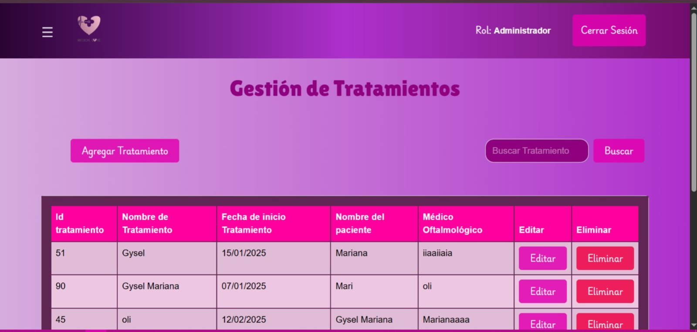

### Reporte de facturas

📌 Sistema de Gestión Médica

Este proyecto es una aplicación web desarrollada en Python (Flask) con integración de HTML, CSS, JavaScript y Bootstrap, orientada a la gestión de información médica.

Permite a los usuarios (administradores) gestionar de forma eficiente clínicas, pacientes, médicos y tratamientos a través de una interfaz moderna y amigable.

🚀 Tecnologías utilizadas

Backend: Python (Flask)

Frontend: HTML5, CSS3, JavaScript, Bootstrap

Base de datos: MySQL

Entorno: Visual Studio Code

⚙️ Funcionalidades principales

🔐 Autenticación de usuario (rol de Administrador).

🏥 Gestión de clínicas (registro, edición y eliminación).

👨‍⚕️ Gestión de médicos especialistas.

👩‍🦰 Gestión de pacientes.

💊 Gestión de tratamientos (alta, edición, eliminación y búsqueda).

📊 Interfaz dinámica con tablas y modales para CRUD.

🎨 Diseño responsivo con Bootstrap y estilos personalizados.

📂 Estructura del proyecto
src/

│── static/

│   ├── css/

│   │   └── style.css

│   ├── js/

│   └── imagenes/

│

│── templates/

│   ├── admi.html

│   ├── clinicas.html

│   ├── pacientes.html

│   ├── tratamiento.html

│   ├── login.html

│   ├── registro.html

│   └── ...
│
│── app.py

│── database.py

│── requirements.txt

│── README.md

⚡ Instalación y ejecución

Clonar el repositorio

](https://github.com/MarianaRQ/clinica.git)
cd gestion-medica

Crear y activar un entorno virtual

python -m venv venv
venv\Scripts\activate   # En Windows
source venv/bin/activate # En Linux/Mac

Instalar dependencias

pip install -r requirements.txt

Configurar la base de datos en database.py.

Ejecutar la aplicación

python app.py

Acceder en el navegador:

http://127.0.0.1:4000

📌 Créditos

👩‍💻 Desarrollado por Gysel Mariana Rodriguez como proyecto académico de gestión médica con Python, Flask y Bootstrap.

📌 Créditos

👩‍💻 Desarrollado por [Tu Nombre] como proyecto académico de gestión médica con Python, Flask y Bootstrap.
